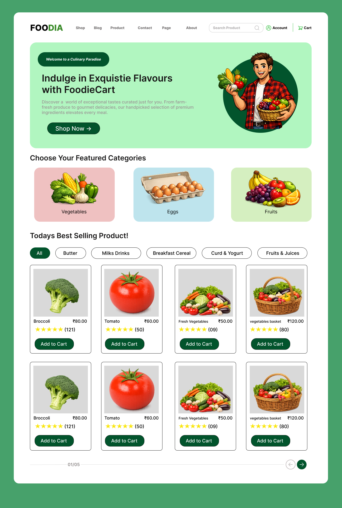
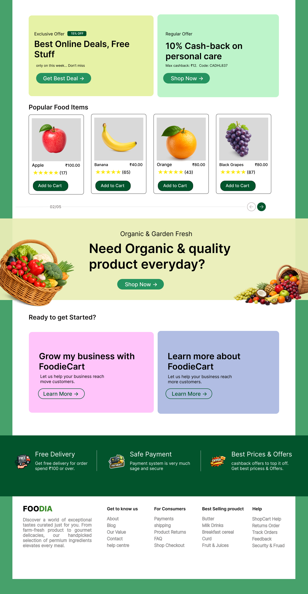
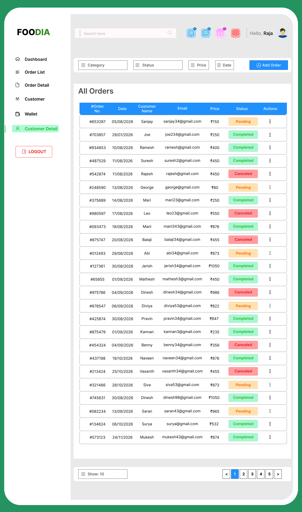
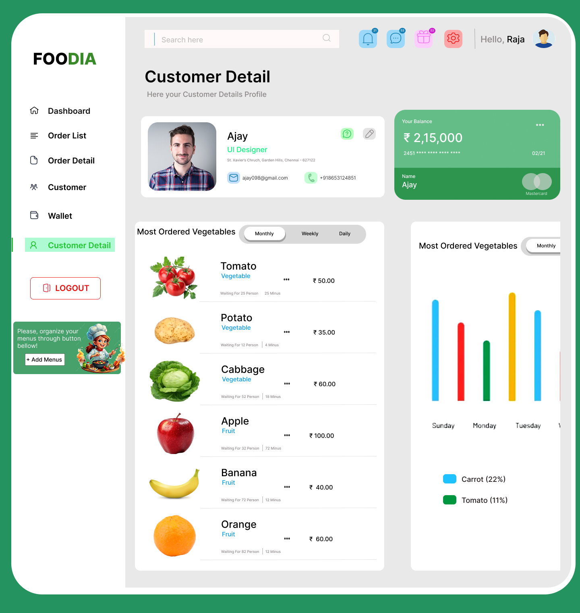
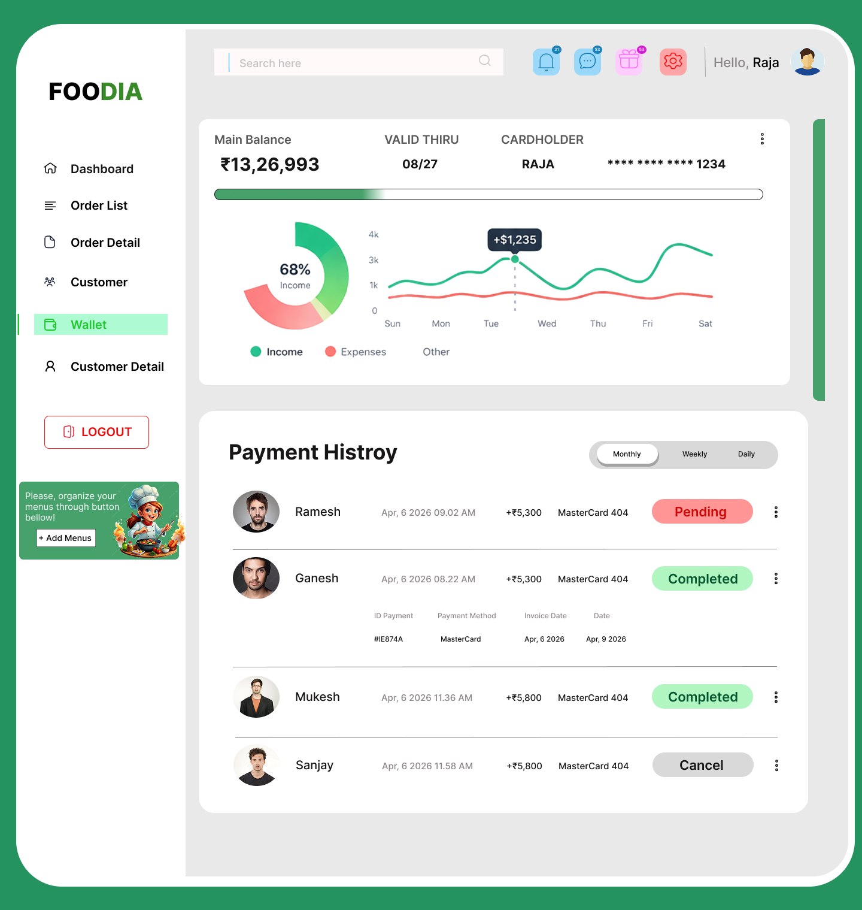

# foodia-ui-ux-design
FOODIA

# 🟢 FOODIA – Online Vegetable Delivery Platform

A clean and user-friendly UI/UX design project focused on making vegetable shopping simple and efficient.

---

## 🌱 About the Project

FOODIA is designed to provide a smooth and intuitive grocery shopping experience.  
The goal was to reduce complexity and create a clean interface that helps users quickly find and purchase products.

Along with the user interface, an admin dashboard is also designed to manage orders, payments, and customer data efficiently.

---

## 🎯 Key Features

- Simple and clean UI design  
- Easy product browsing  
- Smooth add-to-cart experience  
- Order management dashboard  
- Wallet and payment tracking  
- Customer detail interface  

---

## 🎨 Design Highlights

- Green-based color theme 🌿  
- Minimal and modern layout  
- Card-based UI components  
- Clear visual hierarchy  

---

## 📸 Screens

### 🏠 Homepage

### 📊 SecondPage

### 💰 Order List

### 👤 Customer Details

### 📝 Reviews

---

## 🎨 Figma Design
👉 https://www.figma.com/proto/kzxIAMR7elQNODnoZQP3bO/Website?node-id=0-1&t=tEuWBEQNuM4DTaN8-1

---

## 🔗 Case Study
👉 https://www.behance.net/gallery/247826679/Online-Vegetable-Delivery-Platform-UiUx-Design

## 🧑‍🏫 Linkedin
👉 https://www.linkedin.com/in/aakashr076/

---

## ✨ Author
Aakash R
